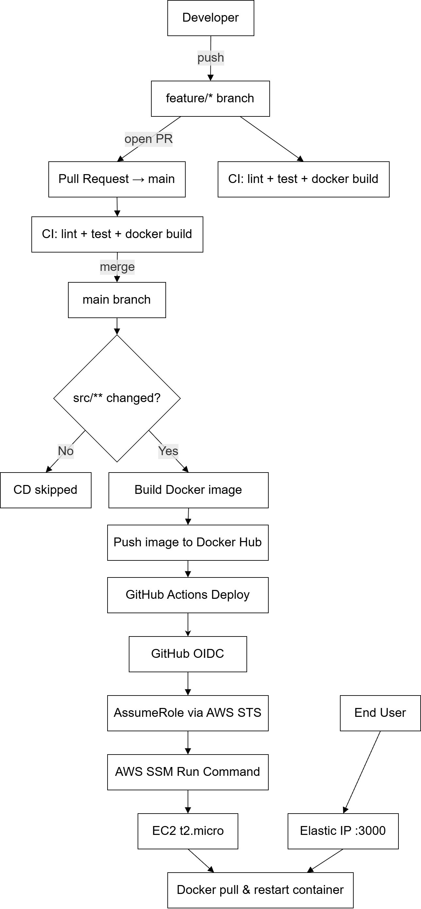
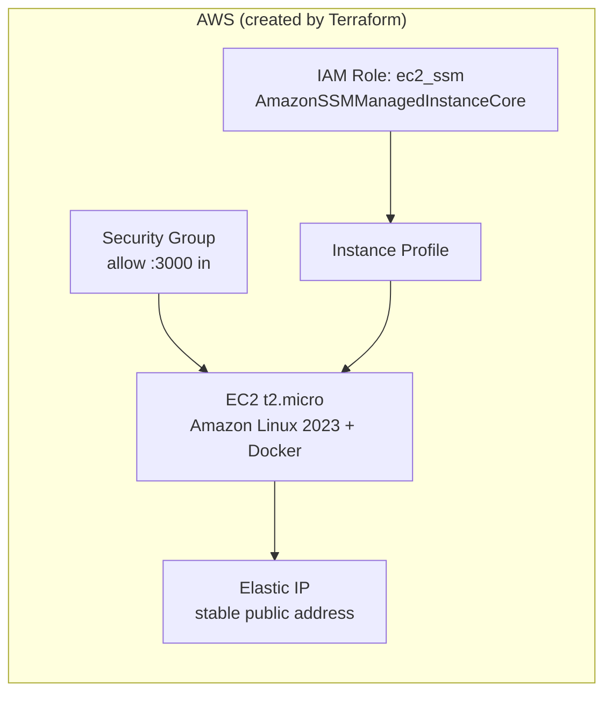

# Golden Owl DevOps Internship Challenge

Node.js app, dockerized, with CI/CD via GitHub Actions deploying to AWS EC2. Original challenge brief: [docs/REQUIREMENTS.md](docs/REQUIREMENTS.md) (initial README.md of this project that I change name and move here)

## Solution

### Stack

| Part | What's used | Notes |
| --- | --- | --- |
| Container | [`src/Dockerfile`](src/Dockerfile), `node:24-alpine` | Single-stage, `npm ci --omit=dev`, non-root user, healthcheck |
| Registry | Docker Hub | `docker.io/hutusnov/goldenowl-devops-challenge` |
| Branching | GitHub Flow | `feature/*` branches -> PR into `main` (protected, need passing CI) |
| CI | [`.github/workflows/ci.yml`](.github/workflows/ci.yml) | Run on every push/PR except `main` itself: lint, test, Docker build check, Trivy image scan (report-only, results in Security tab) |
| CD | [`.github/workflows/cd.yml`](.github/workflows/cd.yml) | Run on push to `main` (only when `src/**` change): build + push image, deploy to EC2 via SSM |
| Infra | [`infra/`](infra) (Terraform) | 1 EC2 `t2.micro` (Amazon Linux 2023 + Docker), SSM role, GitHub OIDC deploy role |
| Deploy auth | GitHub OIDC + `PROD` environment | CD assume a role that only trust the `deploy` job |
| Dependency updates | [`.github/dependabot.yml`](.github/dependabot.yml) | Weekly, npm/GitHub Actions/Terraform. Major bumps blocked by default (need manual review); minor/patch grouped into 1 PR |

### Local development

```shell
cd src
cp .env.example .env   # NODE_ENV=development, PORT=3000
npm i
npm test
npm start
```

`.env` is gitignored and dockerignored - it only ever affect `npm start` on your machine. The production container never read it: [`src/Dockerfile`](src/Dockerfile) hardcode `ENV NODE_ENV=production`, so local (`development`) and container (`production`) stay cleanly separated.

### Flow diagram



### On load balancing and auto-scaling

> The brief mentions a load balancer and auto-scaling as a "nice to have." We thought about it and chose not to build it - here's why.

This app runs on a single server, with nothing spreading traffic across multiple copies of it. That's on purpose: a load balancer costs real money just to exist (~$16-25/month, before any traffic even arrives), and this app is one simple page with basically no visitors to spread out - adding one would just be extra cost and moving parts for no real benefit.

If this app ever needed to handle serious traffic, here's what we'd add:
- Multiple copies of the server running at once, automatically added or removed based on load
- A load balancer in front, spreading requests across them and checking each one is healthy
- The public web address would point at the load balancer instead of one fixed server

### Infrastructure setup (Terraform)



```shell
cd infra
terraform init
terraform apply \
  -var="github_repo=hutusnov/goldenowl-devops-internship-challenge"
```

This provision the EC2 instance, its SSM role, and the GitHub OIDC deploy role. The outputs of `instance_id` and `github_actions_role_arn` are for the GitHub secrets below.

### Required GitHub Secrets

Set these under **Settings -> Secrets and variables -> Actions**:

| Secret | Description |
| --- | --- |
| `DOCKERHUB_USERNAME` | Repository secret. Docker Hub username |
| `DOCKERHUB_TOKEN` | Repository secret. Docker Hub access token (Account Settings -> Security) |
| `AWS_GITHUB_ACTIONS_ROLE_ARN` | **`PROD` environment secret** (`Settings -> Environments -> PROD -> Environment secrets`). `github_actions_role_arn` output from `terraform apply` |
| `EC2_INSTANCE_ID` | **`PROD` environment secret**. `instance_id` output from `terraform apply` |

The 2 AWS secrets must be added under the `PROD` environment specifically, not as regular repository secrets - that way, only the actual deploy step can ever read them.

### Credential management

- **AWS:** no password or key.
- **Docker Hub:** a limited-permission access token is used instead of the real account password.
- **No secrets in source code:** anything sensitive (`.env` files, credentials, Terraform's local state) is excluded from version control.

### Repo setup

In GitHub settings:
- **Branch protection** on `main`: require a pull request before merging, require the `CI / Lint & Test` and `CI / Docker Build Check` status checks to pass.
- **Environments** (`Settings -> Environments`): create `PROD`. Optionally require a manual approval reviewer so a merge to `main` pauses for sign-off before it deploy.

### Verifying a deployment

An Elastic IP keep the address stable across manual stop/start (see `terraform output instance_public_ip`, or):

```shell
aws ec2 describe-instances --instance-ids <EC2_INSTANCE_ID> \
  --query 'Reservations[0].Instances[0].PublicIpAddress' --output text

curl http://<public-ip>:3000/
# {"message":"Welcome warriors to Golden Owl!"}
```

## FinOps

This runs theoretically at **$0/month** while the AWS account's free tier is active (the first 12 months). One command (`terraform destroy`) I made beloww) tears the whole thing down when it's no longer needed.

## Runbook (maintenance and troubleshooting)

### View logs

```shell
aws ssm start-session --target <EC2_INSTANCE_ID>
sudo docker logs -f app
```

### Roll back a bad deploy

Every deploy is saved under its own tag (the commit hash), so going back to an older one just means re-running an older tag:

```shell
aws ssm start-session --target <EC2_INSTANCE_ID>
sudo docker pull hutusnov/goldenowl-devops-challenge:<previous-sha>
sudo docker stop app && sudo docker rm app
sudo docker run -d --name app --restart unless-stopped -p 3000:3000 \
  hutusnov/goldenowl-devops-challenge:<previous-sha>
```

Find `<previous-sha>` in the `main` branch's commit history, or on the Docker Hub tags page.

### Troubleshooting

| Symptom | Approach |
| --- | --- |
| Deploy command fails, instance not found | The EC2 instance is stopped or still starting up - check it's `running`, wait a minute if it just started, then retry |
| The site (`curl`/browser) doesn't respond | Confirm the instance is `running`, check the security group still allows port 3000 |
| Container shows unhealthy | App crashed, or isn't listening on the right port - check the logs (see "View logs" above) |
| CI fails on the lint step | Run `npm run lint:fix` and `npm run format:write` locally, then push again |
| GitHub Actions can't deploy on a non-`main` branch | Expected - only `main` is allowed to deploy, by design |
| GitHub Actions can't deploy even on `main` | Something changed in the AWS trust setup - see [infra/main.tf](infra/main.tf) |

### Known vulnerabilities

There are some known vulnerabilities in the application that need to be addressed, but please note that I did nothing below in the plan because I think in a real context, I'd need approval to change them - so I just left it as a note.

Every build gets scanned for security issues (Trivy, in [`ci.yml`](.github/workflows/ci.yml)). Right now the scan only reports problems, it doesn't block anything (`exit-code: "0"`) - full results: [Trivy_scan_results.png](docs/Trivy_scan_results.png).

**What's causing it:** two packages (`nodemon`, `eslint-plugin-jest`) are dev tools that got listed in the wrong spot in `src/package.json` - they're marked as things the app needs to *run*, when they're actually only needed while *writing* the code.

| Group | Count | How it gets fixed |
| --- | --- | --- |
| `@babel/traverse`, `braces`, `cross-spawn`, `flatted`, `minimatch`, `picomatch` | 1 CRITICAL, 5 HIGH | Move `eslint-plugin-jest` and `nodemon` to the right spot in `package.json` |
| `body-parser`, `path-to-regexp` | 2 HIGH | Dependabot opens a PR bumping `express`, merge it |
| `undici` | 1 HIGH | Not a real issue - this package isn't even installed. The scanner is confused by a leftover file (`package-lock.json`) still sitting in the image. Fixed by removing that file after install |

**Plan:**
1. Move `nodemon` and `eslint-plugin-jest` to `devDependencies` in `package.json` - safe, nothing in production actually uses them.
2. Accept Dependabot's `express` update when it opens (or bump it manually) - fixes `body-parser`/`path-to-regexp`.
3. Stop shipping `package-lock.json` inside the Docker image - fixes the `undici` false alarm.
4. Re-scan, confirm the finding count is 0.
5. Turn the scan back into a blocker (`exit-code: "1"`) so future problems fail the build instead of just getting logged.

### Reviewing the auto-update (Dependabot) PRs

A bot ([`dependabot.yml`](.github/dependabot.yml)) checks weekly for outdated packages and opens PRs by itself. It's set to only propose small, low-risk updates automatically - anything bigger is skipped on purpose, since bigger updates can break things and need a real look first.

If one of these PRs fails its CI check, don't merge it - close it instead. If the same package keeps causing failures, add it to the `ignore` list in `dependabot.yml` so the bot stops re-proposing it. (This already happened once: an `eslint` update broke things because a plugin we use wasn't compatible with it yet.)

### Tearing everything down

If this deployment is no longer needed, one command removes it all - the server, the AWS permissions, everything Terraform created:

```shell
cd infra
terraform destroy \
  -var="github_repo=hutusnov/goldenowl-devops-internship-challenge"
```

(Docker Hub images aren't managed by this command and would need deleting separately, if wanted.)

## Documentation

- [docs/REQUIREMENTS.md](docs/REQUIREMENTS.md) - the original challenge brief
